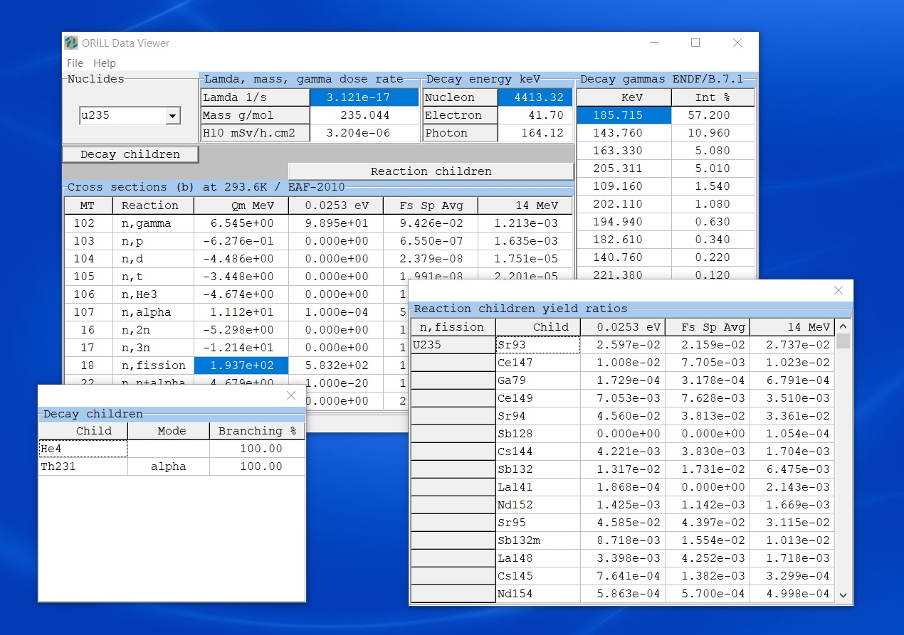

============
Nuclear Data
============

Libraries
---------

ORILL Code data are parsed from evaluated libraries in ENDF-6 or ACE format by using the `PyNE <https://pyne.io/>`_
toolkit. Parsing features are not provided with ORILL public version. However, data provided with public ORILL have been selected from several libraries in order to cover a wide range of situations:

 - Nuclide set consists of 3851 nuclides from the European Nuclear Data `JEFF-3.3 <https://www-nds.iaea.org/public/download-endf/JEFF-3.3/>`_ decay sub-library.
 - Incident neutron data cover 816 nuclides cross sections and multiplicities from the European Activation File (`EAF 2010 <https://www-nds.iaea.org/public/download-endf/EAF-2010/>`_) at 293.6K: (**only (n,2n), (n,3n), (n,fission), (n,gamma), (n,p), (n,n+p), (n,d), (n,t), (n,3He), (n,alpha), (n,n+alpha)** reactions are selected).
 - Direct (independent) induced fission yields of 83 nuclides are from TENDL 2011 `TALYS <http://www.talys.eu/>`_ nuclear model code system (**only products with yields > 0.01%** are selected).
 - Effective dose coefficients for inhalation (adult, public) includes 1975 nuclides from EAF 2010 and `ICRP 72 <http://www.icrp.org/publication.asp?id=ICRP%20Publication%2072>`_.
 - Fluence to effective dose coefficients (H*(10)) are from ICRP 74 (we consider ICRP 116 values questionable).

The choice of EAF 2010 and TENDL 2011 was made to enlarge the data set in terms of available cross sections and fission products (independent fission yields).

Radiological protection
-----------------------

The effective dose coefficients for inhalation (Sv/Bq) (adult, public) from EAF 2010 comprises ICRP 72 data and calculated coefficients by the EAF project. Be careful that EAF 2010 coefficients for inter gases (Ar, Kr, Xe) have been converted from dose rate unit per air concentration to Sv/Bq, based on the metabolic behavior of Yttrium (`EAF 2010 biological, clearance and transport libraries <http://www.ccfe.ac.uk/assets/Documents/CCFE_R(10)04.pdf>`_, *L. W. Packer and J-Ch. Sublet, EURATOM/CCFE Fusion Association*).
These coefficient are therefore much more conservative than in the ICRP 72.

ORILL Data Viewer
-----------------

ORILLDataView.exe is a graphical user interface to visualize ORILL nuclear data. A demo program for Windows can be found `here <https://github.com/orill/orill/blob/master/bin/ORILLDataSetup.exe>`_. 

Warning
-------

ORILL Code public version is provided for educational purpose, with limited nuclear data.
Additional data is available for individuals or institutions that would like to collaborate.

